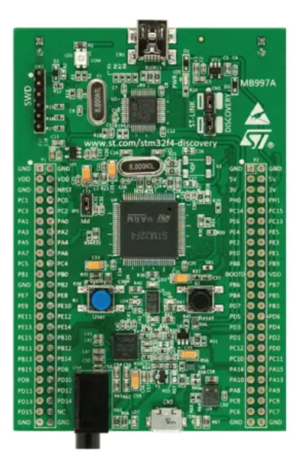

<style>
img[alt~="center"] {
  display: block;
  margin: 0 auto;
}
section.small li {
    font-size: 30px;
}
</style>

# Embedded Rust: что нового?
<!-- _class: lead invert -->
Anton Patrushev
RustCon Russia, 2023

---

## Про себя
<!-- _class: invert -->
- долгие годы - воинствующий питонист
- пет-проекты на AVR/STM32 c конца нулевых (с/с++/μpython)
- первые буквы на rust, которые устроили компилятор в 2015
- в 2018 начал экпериментировать с embedded rust
- python extensions (pyo3/setuptools-rust)
- делал мастеркласс на RustCon Russia 2021

---

## Немного про задачу
<!-- _class: lead invert -->

---

## Целевая четверенька
<!-- _class: invert -->
- AVR, MSP430, Cortex-M/R, Risc-V, AVR
- мало памяти - единицы/десятки Кб
- отсутствие MMU
- переферийные устройства - GPIO/bitbang, 1-Wire, SPI, I2C

---

## Что было до этого
<!-- _class: invert -->
- IDE - Arduino, Keil, IAR, STM32CubeIDE
- SDK от производителя (CMSIS, SPL, HAL, LL, RTOS, BSP)
- или не от производителя (libopencm3)
- драйвера? какие такие драйвера?
- портируемость? слово-то какое придумал!
  - правильно говорить вендор-лок!
- отладка: OpenOCD + GDB

---

## Почему Rust
<!-- _class: invert -->
- system level language
- memory safety
- zero-cost abstractions
- no-std
- portability

---

## Как всё началось
<!-- _class: invert -->
- svd2rust, 2016
- @japaric, 2017
  - если вас не устраивает объяснение "а внутре у ей неонка", то я рекомендую [серию его статей](https://blog.japaric.io/) про embedded rust
- embedded wg, 2018
- Ferrous Systems, 2018

---

## What's new?

### Поехали

<!-- _class: lead invert -->
---

## Поддержка новых платформ

<!-- _class: lead invert -->
---

## Espressif
<!-- _class: invert -->
- espup
- [книжка](https://esp-rs.github.io/book)
- девайсы:
  - Xtensa (ESP8266, ESP32, ESP32-Sx), RISC-V (ESP32-Cx)
- no-std
- std + интеграция с IDF
  - IoT Development Framework
  - embedded-svc

---

## Другие, текущее состояние
<!-- _class: invert -->
- Cortex-M (STM, RP2040, nRF)
- ESP32/Xtensa
- RISC-V
- MSP430
- AVR
- MIPS

---

## Стандартизация библиотек

<!-- _class: lead invert -->
---

## Cтек
<!-- _class: invert -->


---

## Пример, low level
<!-- _class: invert -->


- stm32f4
  - svd2rust, pac, chip specific code
- embedded-hal
  - platform agnostic base
- stm32f4xx-hal
  - hal implementation using stm32f3

---

## Пример, high level
<!-- _class: invert -->


- accelerometer
  - hal, device agnostic interfaces
- lis302dl
  - device specific => embedded-hal SPI
- stm32f407g-disc
  - concrete board
  - wiring all together
- application

---

## embedded-hal
<!-- _class: invert -->
- зачем? платформо-независимые драйвера
- драйверо-независимые приложения
- удобный dev/debug (SPI/I2C/bitbang на RPi)
- растёт поддержка в hal/bsp крейтах
- v1 - release candidate

---

## heapless
<!-- _class: invert -->
- static friendly
- data structures
  - Vec/String/IndexMap/IndexSet/BinaryHeap
  - Arc/Box
  - Queues (mpmc/spsc)

---

## alloc
<!-- _class: invert -->
- embedded-alloc (ex. alloc-cortex-m)
  - portability
  - stable rust support
- initial allocator_api (unstable) support

---

## Фреймворки и ОС

<!-- _class: lead invert -->
---

## Зачем они вообще нужны
<!-- _class: invert -->
- эргономичность
- удобство работы с прерываниями
- статические гарантии
  - гонки
  - дедлоки
  - инверсия приоритетов

---

## rtic
<!-- _class: invert -->
- с него всё начиналось (в девичестве, cortex-m-rtfm)
- легковесный concurency framework
- жесткие статические гарантии
  - RTFMv2
- только Cortex-M
- async tasks
- rtic-sync

---

## rtic, task

```rust
    #[task(local = [led, state])]
    fn blink(cx: blink::Context) {
        rprintln!("blink");
        if *cx.local.state {
            cx.local.led.set_high().unwrap();
            *cx.local.state = false;
        } else {
            cx.local.led.set_low().unwrap();
            *cx.local.state = true;
        }
        blink::spawn_after(Duration::<u64, 1, 1000>::from_ticks(1000)).unwrap();
    }
```

---

## rtic, async task

```rust
    #[task(local = [led, state])]
    async fn blink(cx: blink::Context) {
        loop {
            rprintln!("blink");
            if *cx.local.state {
                cx.local.led.set_high().unwrap();
                *cx.local.state = false;
            } else {
                cx.local.led.set_low().unwrap();
                *cx.local.state = true;
            }
            Systick::delay(1000.millis()).await;
        }
    }
```

---

## embassy
<!-- _class: invert -->
- EMBedded ASYnc
- большой заход на асинхроннсть c надстройками HAL/PAC
- асинхронные драйвера (I2C/SPI/USB/NET)
- по тяжеловестности - среднее решение
- подталкивают развитие языка
  - async-fn-in-trait (AFIT)
- лучшая поддержка в решениях Espressif

---

## lilos
<!-- _class: invert -->
- Cortex-M only
- ближе к embassy по концепции
  - fixed set of concurrent tasks that run forever
- cooperative multitasking
- platform agnostic

---

## Сравнение, эргономика

<!-- _class: small -->

- embassy
  - самый эргономичный и понятный код
  - платформенная специфика спрятана в embassy-hal
  - гарантии безопасности где-то в библиотеке
- rtic
  - наиболее сложный для восприятия код
  - взамен: статические гарантии безопасности
- lilos
  - средний по сложности код
  - наедине с голым железом (HAL/BSP)

---

## Сравнение, размер
<!-- _class: invert -->
- здесь был слайд про размер "исполняемых файлов"
- но на моих примерах размеры оказались идентичными

---

## "Операционные системы"
<!-- _class: invert -->
- preemtive multitasking
- isolation
- ipc
- applications
- варианты
  - hubris (2.5k⭐️, 45c)
  - tockos (4.7k⭐️, 176c)

---

## Инструменты

<!-- _class: lead invert -->
---

## probe-rs
<!-- _class: invert -->
- Ferrous Systems, Knurling Tools, ex. probe-run
- Any ARM/Risc-V target
- CMSIS-DAP/JLink/ST-Link and FTDI
- простейшие flash/run/debug
- полноценный плагин для VS Code (DAP для остальных)

---

## defmt
<!-- _class: invert -->
- "deferred formatting"
- классические log макросы к которым все привыкли
- минимальное влияет на тайминг исполнения
- настройка фильтров в момент компиляции
- rtt/itm/semihosting/кастомный логгер

---

## ferrocene
<!-- _class: invert -->
- сертифицированны toolchain
- критически важные системы
- ISO 26262 (траспортные средства)
- IEC 61508 (системы обеспечения безопасности)
  - SIL 4 (максимальный уровень)

---

## Это всё. Вопросы?
<!-- _class: invert -->
- мой awesome-embedded-rust (filtered) можно найти тут =>

- все контакты https://patrushev.me
